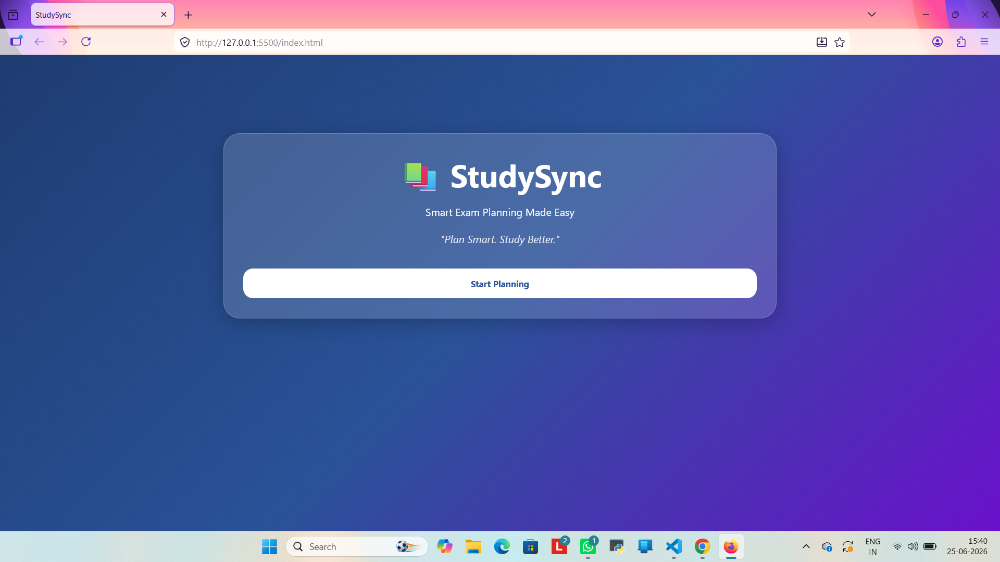
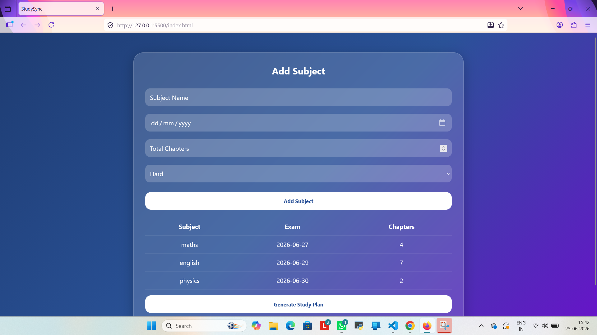
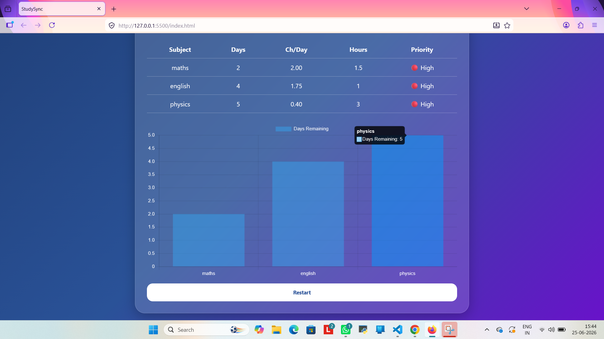

# 📚 StudySync – Smart Exam Planner

StudySync is a simple and interactive web application that helps students manage multiple subjects and plan their exam preparation efficiently.

It calculates study workload based on exam dates, number of chapters, and difficulty level, and generates a personalized study plan.

---

## Features

- Add multiple subjects
- Exam date tracking
- Automatic calculation of days left
- Chapters per day estimation
- Study hours recommendation based on difficulty
- Priority labeling (High / Medium / Low)
- Visual dashboard using Chart.js
- Clean and responsive UI

---

## Tech Stack

- HTML5
- CSS3
- JavaScript (Vanilla)
- Chart.js (for visualization)

---

## 📸 Screenshots

### Home Page

### Subject Entry

### Study Plan

### Dashboard Chart

---

## How It Works

- Users input subject details
- System calculates remaining days until exam
- Workload is distributed automatically
- Dashboard displays study plan with visual chart

---

## Purpose

This project was built to understand:
- DOM manipulation
- Date handling in JavaScript
- Array and object usage
- Basic data visualization

---

## Author

Hannah Mariam Majnu
